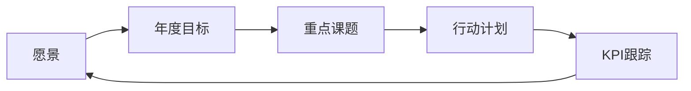

# 🎯 战略与目标

> 方针管理、KPI、战略部署

---

## 当前年度方针

- **年度目标**：
- **重点课题**：
  - 
  - 
  - 

## 关键KPI

| KPI | 年度目标 | Q1 | Q2 | Q3 | Q4 |
|-----|---------|----|----|----|----|
| OEE | 85% | | | | |
| 良品率 | 99.5% | | | | |
| 交付及时率 | 98% | | | | |
| 成本降低率 | 5% | | | | |

## 战略部署 (Hoshin Kanri)



## 相关笔记

```dataview
LIST
FROM "01_战略与目标"
SORT file.cday DESC
```
