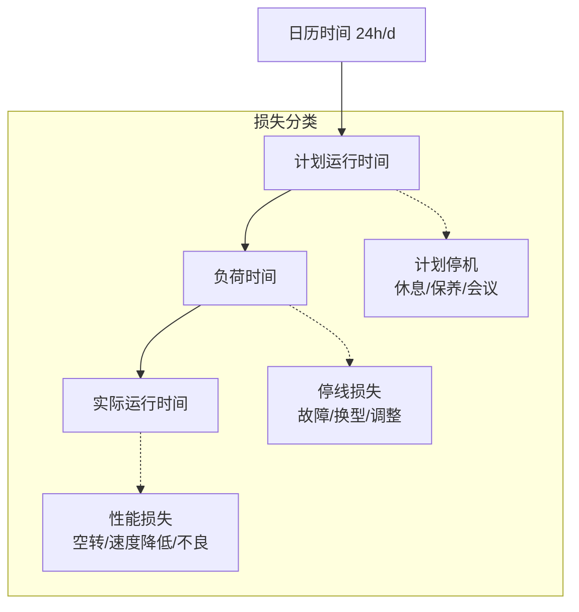

# 📊 OEE — 设备综合效率

> Overall Equipment Effectiveness

---

## 什么是OEE

OEE是衡量设备利用效率的黄金标准，也是精益管理中最核心的指标之一。它将设备运行状态分为可用性、性能、质量三个维度，综合反映设备能为企业创造多少价值。

## 详细计算

### 时间维度



### 分步计算

**时间开动率（Availability）**
```
负荷时间 = 计划运行时间 - 计划停机
时间开动率 = (负荷时间 - 停机损失) / 负荷时间
```
> 停机损失 = 设备故障 + 换型调整 + 工装更换 + 启动暖机

**性能开动率（Performance）**
```
性能开动率 = (理论节拍 × 产量) / 实际运行时间
```
> 性能损失 = 空转/短暂停机 + 速度降低

**合格品率（Quality）**
```
合格品率 = (总产量 - 不良品数 - 返工数) / 总产量
```
> 质量损失 = 不良品 + 返工 + 试产报废

## 实战应用

### 数据采集方式

| 方式 | 精度 | 成本 | 适用 |
|------|------|------|------|
| 人工记录 | 低 | 低 | 小厂、人工线 |
| 设备PLC | 高 | 中 | 自动化设备 |
| MES系统 | 极高 | 高 | 数字化工厂 |

### OEE计算例

**假设数据：**
- 班次：8小时（480分钟）
- 计划停机：晨会15分钟 + 休息10分钟 = 25分钟
- 负荷时间：480 - 25 = 455分钟
- 停机损失：故障30min + 换型20min = 50分钟
- 实际运行：455 - 50 = 405分钟
- 理论节拍：0.5分钟/件
- 实际产量：700件
- 不良品：14件

```
时间开动率 = 405/455 = 89.0%
性能开动率 = (0.5×700)/405 = 350/405 = 86.4%
合格品率 = (700-14)/700 = 98.0%
OEE = 89.0% × 86.4% × 98.0% = 75.4%
```

### OEE分析套路

1. **看趋势** — 周/月OEE趋势图，判断改善方向
2. **看六大损失** — 帕累托图找主要矛盾
3. **看单机台** — 对比同型号设备，找最佳实践
4. **按班组** — 对比不同班组，找培训和标准化差距

## 常见误区

| 误区 | 正确理解 |
|------|---------|
| OEE越高越好 | 追求合理OEE，过度追求会牺牲柔性 |
| OEE 85%是世界级 | 离散制造业85%已经很优秀 |
| 只看OEE数值 | 必须结合六大损失分析 |
| 所有设备都跑OEE | 瓶颈设备和关键设备优先 |
| 人工记账OEE | 人工数据可信度低，建议自动化采集 |

---

[[02_生产管理|← 返回生产管理]]
