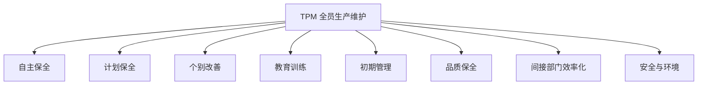

# 🛠️ TPM — 全员生产维护

> Total Productive Maintenance

---

## TPM 三大核心理念

1. **零故障、零不良、零事故** — 设备综合效率最大化
2. **全员参与** — 操作工+维修工+管理者组成团队
3. **预防为主** — 从「坏了修」到「不让它坏」

## TPM八大支柱



### 1. 自主保全 — 操作工的日常维护
- **7步骤**：初期清扫→对策→临时标准→总点检→自主点检→标准化→自主管理
- **日常点检**：操作工每日进行的清扫、点检、润滑、紧固
- **目视化**：点检标准上墙，使用红黄绿三色标记状态

### 2. 计划保全 — 专业维护团队
- **定期保全**：按时间周期（日/周/月/年）制定的保养计划
- **预测保全**：基于状态监测（振动/温度/油品分析）维护
- **事后保全**：故障后的紧急修复（目标：占比<20%）

### 3. 个别改善 — 针对重大损失的有组织改善
- 识别设备六大损失
- 组建跨职能改善团队
- 设定OEE目标，按PDCA循环改善

## OEE（设备综合效率）

### 计算公式
```
OEE = 时间开动率 × 性能开动率 × 合格品率

时间开动率 = (负荷时间 - 停机时间) / 负荷时间
性能开动率 = (理论节拍 × 生产数量) / 实际运行时间
合格品率 = 合格品数量 / 总生产数量
```

### OEE的六个状态评价

| 区间 | 评价 | 说明 |
|------|------|------|
| ≥85% | 世界级 | 完全竞争水平 |
| 75-85% | 良好 | 有改进空间 |
| 60-75% | 一般 | 通常水平 |
| 50-60% | 较差 | 需重点改善 |
| <50% | 严重 | 必须立即行动 |

### 六大损失

| 类别 | 损失 | 影响OEE维度 |
|------|------|------------|
| 停机 | 1. 设备故障 | 时间开动率 |
| 停机 | 2. 换型调整 | 时间开动率 |
| 速度 | 3. 空转/短暂停机 | 性能开动率 |
| 速度 | 4. 速度降低 | 性能开动率 |
| 质量 | 5. 不良品/返工 | 合格品率 |
| 质量 | 6. 试产/启动损耗 | 合格品率 |

## MTBF与MTTR

| 指标 | 定义 | 意义 | 改善方向 |
|------|------|------|---------|
| MTBF | 平均故障间隔时间 | 越高越稳定 | 预防保全+设计改善 |
| MTTR | 平均修复时间 | 越低越好 | 标准化维修+备件管理 |

---

[[05_设备管理|← 返回设备管理]]
