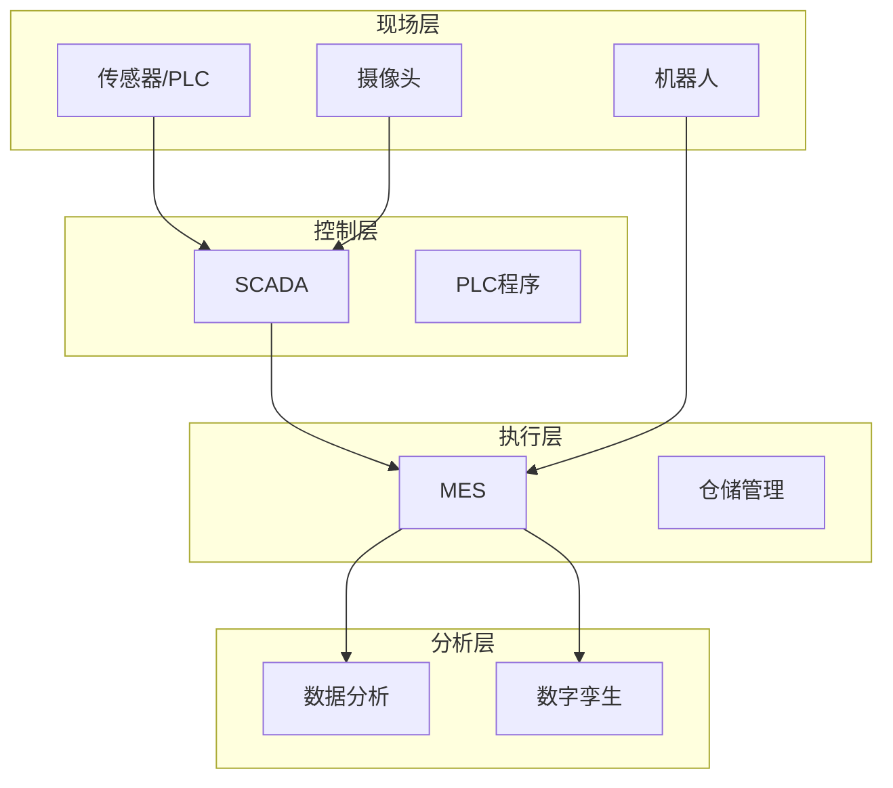

# 🤖 数字化与自动化

> MES、IoT、SCADA、数字孪生

---

## 目录

| 子模块 | 说明 |
|-------|------|
| [[08_数字化与自动化/01_MES]] | 制造执行系统相关 |
| [[08_数字化与自动化/02_IoT]] | 物联网设备与数据 |
| [[08_数字化与自动化/03_SCADA]] | 数据采集与监控 |
| [[08_数字化与自动化/04_数字孪生]] | 数字孪生建模 |

## 系统架构概览

## 已接入设备

| 设备 | 类型 | 接口 | 数据点 | 状态 |
|------|------|------|--------|------|
| | | | | ⚪ |

## IoT数据看板

- 

## 数字化成熟度

| 维度 | 现状 | 目标 |
|-----|------|------|
| 设备联网率 | | 100% |
| 数据自动采集率 | | 95% |
| 数字化追溯覆盖率 | | 100% |
| 智能排程覆盖率 | | 80% |
