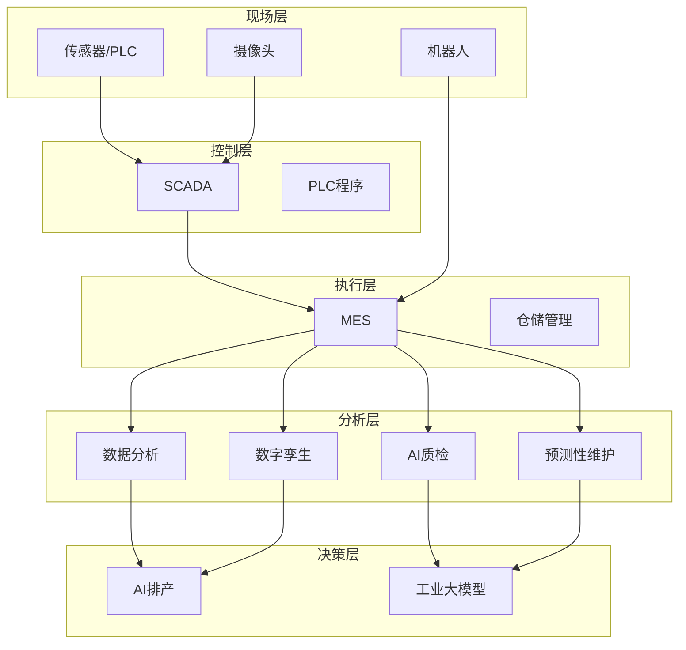

# 🤖 数字化与自动化

> MES、IoT、SCADA、数字孪生、AI工业智能

---

## 目录

| 子模块 | 说明 |
|-------|------|
| [[08_数字化与自动化/01_MES]] | 制造执行系统相关 |
| [[08_数字化与自动化/02_IoT]] | 物联网设备与数据 |
| [[08_数字化与自动化/03_SCADA]] | 数据采集与监控 |
| [[08_数字化与自动化/04_数字孪生]] | 数字孪生建模 |
| [[08_数字化与自动化/AI工业智能应用]] | AI应用全览（新增） |
| [[08_数字化与自动化/内容创作素材库]] | 短视频脚本/选题/日历 |

## 系统架构概览

## AI工业智能应用

详见：[[08_数字化与自动化/AI工业智能应用]]

| AI应用 | 适用场景 | 投入 | ROI周期 |
|--------|---------|:----:|:-------:|
| AI视觉质检 | 表面缺陷/尺寸/装配检查 | 2-5万/工位 | 6-12月 |
| 预测性维护 | 电机/泵/主轴/风机 | 500-2000元/传感器 | 8-14月 |
| AI智能排产 | 多品种小批量排产 | 5-30万 | 3-6月 |
| 工业大模型知识助手 | 设备运维/SOP/根因分析 | 2-10万 | 6-12月 |

## 已接入设备

| 设备 | 类型 | 接口 | 数据点 | 状态 |
|------|------|------|--------|------|
| | | | | ⚪ |

## IoT数据看板

- 

## 数字化成熟度

| 维度 | 现状 | 目标 |
|-----|------|------|
| 设备联网率 | | 100% |
| 数据自动采集率 | | 95% |
| 数字化追溯覆盖率 | | 100% |
| 智能排程覆盖率 | | 80% |
