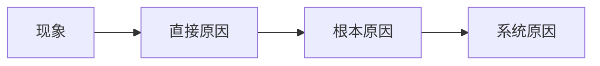

# 8D报告 — {{title}}

- **报告编号**：
- **问题发现日期**：
- **客户/来源**：
- **产品/批次**：
- **严重等级**：⚪ 致命 / ⚪ 严重 / ⚪ 一般 / ⚪ 轻微

---

## D0 — 问题描述

*发生了什么？影响范围？*

## D1 — 组建团队

| 角色 | 姓名 | 部门 |
|-----|------|-----|
| 组长 |      |     |
| 成员 |      |     |
| 成员 |      |     |

## D2 — 问题描述（量化）

- **不良率**：
- **不良数量**：
- **发现时间**：
- **遏制措施**：

## D3 — 临时遏制措施（ICA）

| 措施 | 负责人 | 完成日期 | 效果 |
|-----|-------|---------|------|
|     |       |         |      |

## D4 — 根本原因分析

- **物理原因**：
- **人为原因**：
- **系统原因**：

## D5 — 永久纠正措施（PCA）

| 措施 | 负责人 | 计划完成 | 实际完成 |
|-----|-------|---------|---------|
|     |       |         |         |

## D6 — 措施验证

- **验证方法**：
- **验证结果**：
- **是否关闭**：是 / 否

## D7 — 横向展开

*其他类似产品/工序是否需要同样措施？*

## D8 — 总结与表彰

- **经验教训**：
- **文件标准化**：
- **团队表彰**：

---

[[04_质量管理|← 返回质量管理]]
